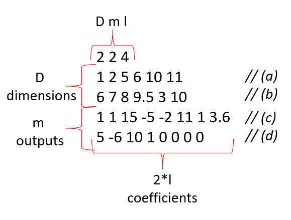

# Project 5 - Numerical Integration

*README is hosted at https://gitlab.epfl.ch/majoor/project-5-numerical-integration*

### Compiling the Program
The following steps should be undertaken to run our code
- clone the repository with `git clone git@gitlab.epfl.ch:majoor/project-5-numerical-integration.git`
- fetch the submodules (Eigen and Googletest) using `git submodule update --init`
- build the executable using CMAKE 
```
mkdir build
cd build
cmake ..
```
- run the executable `./integration`

This code will produce the following output:
```
[to be copy pasted]
```

### Configuring the Program
To run the program with different integrals and different domains of integration, the input file can be configured. An example of the format required is shown below:



The first line details the length of inputs the program should expect. The lines (a), (b), (c) and (d) are then read as follows:
- (a) first domain is between x=1 and x=2, y=5 and y=6 and the integration method undergoes 10 steps in the x direction and 11 steps in the y direction
- (b) first domain is between x=6 and x=7, y=8 and y=9.5 and the integration method undergoes 3 steps in the x direction and 10 steps in the y direction
- (c) first function output reads 1+1i + (15-5i)x + (-2+11i)y + (1+3.6i)x^2
- (d) second function output reads 5-6i + (19+1i)x + (0+0i)y + (0+0i)x^2

### Typical Program Usage
[to be done]

### Program Features
[to be done]

### Tests
Two types of test are run using googletest :
- Tests of the text file reader
- Tests of the integration methods

For the reader, we execute a few death tests to ensure that the first inputs are asserted to be positive.

For the integration, we run tests on polynomials of 4 values of l (l is defined above).
- For l=1, we integrate a constant function and expect an exact solution for all 3 methods.
- For l=3, we expect an exact solution for midpoint and Simpson but an approximate solution for trapezoidal.
- For l=6, we expect an exact solution for Simpson but an approximate solution for midpoint and trapezoidal.
- For l=9, we expect an approximate solution for all 3 methods.